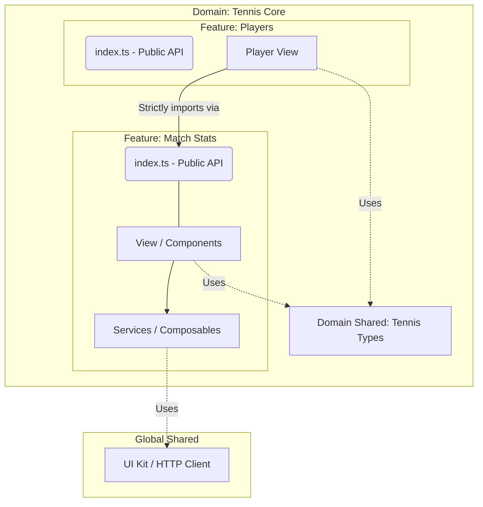

# The 4 Laws of the Architecture

These rules are non-negotiable to maintain the health, scalability, and performance of our Domain-Driven Feature-First architecture.

### 1. The Public API Rule (Cross-Feature Communication)
A feature **MUST NEVER** reach deep into another feature's internal folders. 
If Feature B needs something from Feature A, it must import it exclusively from Feature A's `index.ts` file. 
* **Why?** This creates a strict contract. If it's not exported in `index.ts`, it's private to that feature.

### 2. The "Shared" Rule (Avoid Hasty Abstractions)
- **`src/shared`**: Only for things that know NOTHING about tennis or the business logic. If it mentions a "player" or a "match", it doesn't belong here.
- **`src/domains/[domain]/_shared`**: For code shared *only* between features within the same domain (e.g., a shared `MatchScore` type used by both `match-stats` and `players`).
- **When in doubt, duplicate:** If two features need similar but not identical API calls, duplicate the service in each feature. Do not prematurely abstract it.

### 3. Feature Internal Structure
Each feature under a domain is a self-contained module containing strictly these directories:
- **`components/`**: Smart Vue components tightly coupled to this feature.
- **`composables/`**: Vue reactivity and State specific to the feature.
- **`services/`**: API calls mapping to backend endpoints.
- **`types/`**: TypeScript interfaces and types for this specific feature.
- **`[FeatureName]View.vue`**: The main entry point/page for the router.

### 4. Bundle Size & Performance Rules
- **Lazy Loading is Mandatory:** Every main Feature View must be lazy-loaded in the Vue Router (`const View = () => import(...)`). Vite will automatically chunk these.
- **No Heavy Abstractions:** Keep data mapping simple. Use basic TypeScript functions in the `services/` folder to map backend JSON responses to frontend Types. Avoid heavy reflection/automapper libraries.

## Data flow

